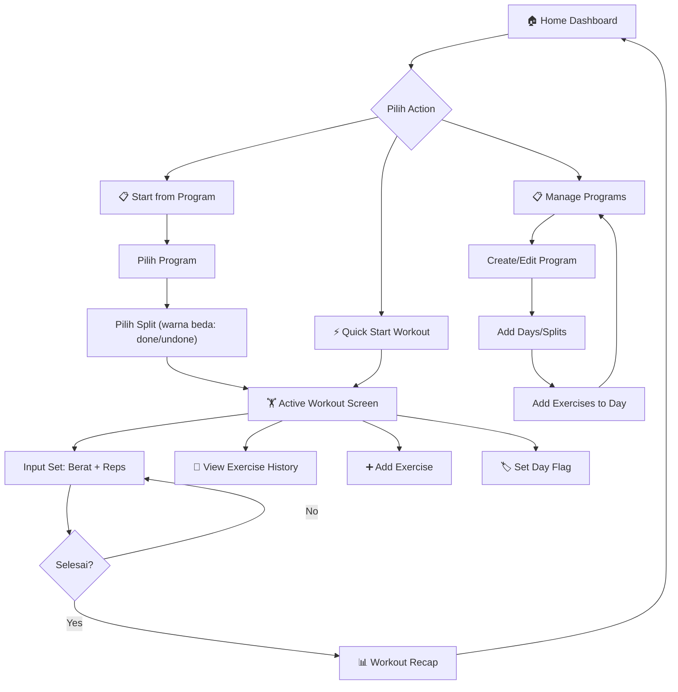
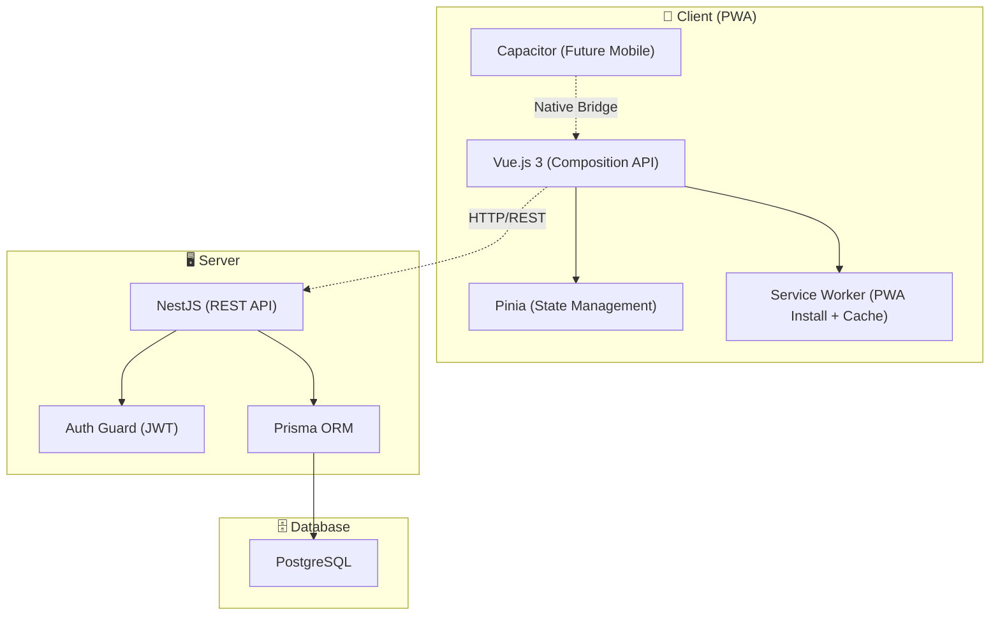
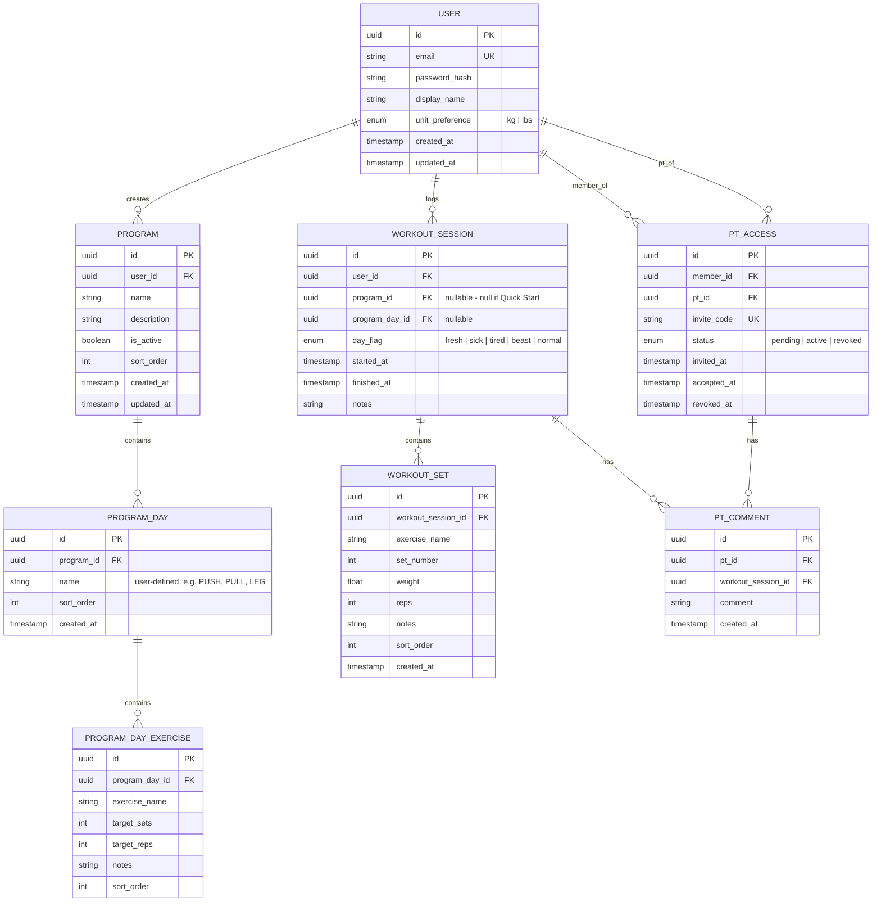
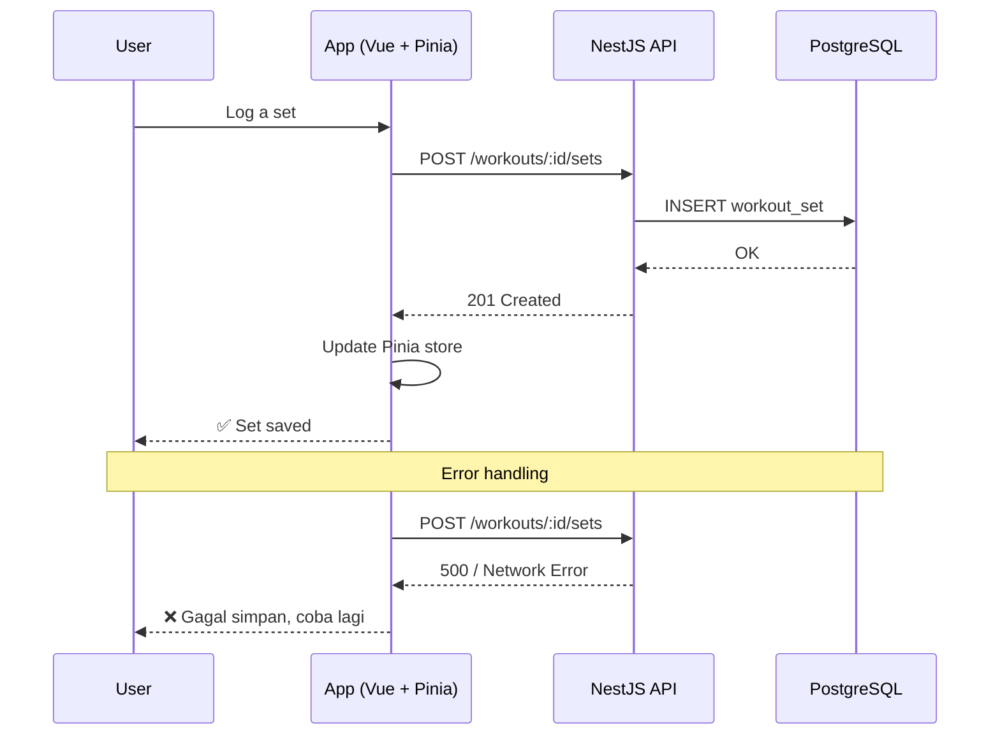

# 🏋️ Jimbor — Gym Tracker PRD

> **Version**: 1.0 Draft  
> **Created**: 2026-04-05  
> **Author**: AI-assisted  
> **Status**: Draft — Awaiting Review

---

## 1. Executive Summary

### Problem Statement

Gym-goers sering kesulitan melacak progres latihan secara konsisten. Aplikasi gym tracker yang ada di pasaran terlalu kompleks, tidak fleksibel, atau tidak mendukung hubungan **Personal Trainer (PT) ↔ Member** untuk pemantauan progres. Pengguna membutuhkan cara cepat untuk memulai sesi latihan, melihat history latihan sebelumnya saat input, dan memiliki gambaran visual konsistensi latihan mereka.

### Proposed Solution

**Jimbor** — sebuah Progressive Web App (PWA) gym tracker yang memungkinkan pengguna:
1. Membuat dan menjalankan **program latihan terstruktur** (Push/Pull/Legs, dll.) dengan fleksibilitas menambah gerakan.
2. **Quick Start** sesi latihan tanpa program — input gerakan secara langsung.
3. Melihat **exercise history** (berat, reps, set, notes, kondisi tubuh) saat melakukan input.
4. Memvisualisasikan konsistensi latihan melalui **GitHub-style activity heatmap**.
5. Mendukung fitur **PT Monitoring** — seorang PT dapat memantau progres member-nya.

### Success Criteria

| KPI | Target | Measurement |
|-----|--------|-------------|
| Workout logging time | ≤ 30 detik per exercise entry | In-app timing dari tap "Add" hingga "Save" |
| Data load time (history) | ≤ 500ms untuk 1 tahun data | Lighthouse & real-user monitoring |
| PWA Lighthouse Score | ≥ 90 (Performance, PWA) | Lighthouse audit |
| User retention (personal use) | Digunakan ≥ 4x/minggu selama 3 bulan | Analytics |

---

## 2. User Experience & Functionality

### 2.1 User Personas

#### Persona 1: Gym Enthusiast (Primary)
- **Nama**: Bro Jimbo
- **Deskripsi**: Laki-laki 25 tahun, gym 4-6x seminggu, suka tracking progres dan PR (Personal Record).
- **Pain Points**: Capek catat di notes HP, sering lupa beban terakhir, tidak punya gambaran konsistensi.
- **Goals**: Tracking cepat, lihat history instan, visualisasi konsistensi.

#### Persona 2: Personal Trainer (Secondary)
- **Nama**: Coach Andi
- **Deskripsi**: PT profesional dengan 10+ member aktif.
- **Pain Points**: Susah monitor progres member tanpa minta screenshot atau chat manual.
- **Goals**: Dashboard untuk melihat history dan konsistensi member.

---

### 2.2 User Stories & Acceptance Criteria

#### Epic 1: Program Management

| ID | User Story | Priority |
|----|-----------|----------|
| US-1.1 | Sebagai user, saya ingin **membuat program latihan** (contoh: "Push Pull Legs") agar saya punya struktur latihan yang terorganisir. | P0 |
| US-1.2 | Sebagai user, saya ingin **menambahkan split** ke dalam program dengan nama yang saya tentukan sendiri (contoh: "PUSH", "PULL", "LEG", "Push Day", dll.) agar jadwal latihan saya jelas. | P0 |
| US-1.3 | Sebagai user, saya ingin **menambahkan exercise/gerakan** ke setiap hari/split (contoh: Bench Press, Incline DB Press di hari Push) agar saya tahu apa yang harus dilakukan. | P0 |
| US-1.4 | Sebagai user, saya ingin **mengedit dan menghapus** program, hari, atau exercise yang sudah dibuat agar program saya selalu up-to-date. | P0 |
| US-1.5 | Sebagai user, saya ingin **menambahkan exercise tambahan secara ad-hoc** saat menjalankan program agar latihan tetap fleksibel. | P0 |
| US-1.6 | Sebagai user, saya ingin **meng-reorder exercise** dalam satu hari/split dengan drag & drop agar urutan latihan sesuai preferensi. | P1 |

**Acceptance Criteria (US-1.1 - US-1.4):**
- User dapat membuat program dengan nama dan deskripsi opsional
- Program berisi 1 atau lebih "Split"
- Setiap Split memiliki nama yang ditentukan user secara manual (contoh: "PUSH", "PULL", "LEG", "Upper Body", dll.) dan list exercise
- Exercise memiliki: nama, target set, target reps, notes opsional
- Semua CRUD operations membutuhkan koneksi internet (online-only untuk MVP)
- Validasi: nama program dan exercise wajib diisi, tidak boleh duplikat nama program

---

#### Epic 2: Workout Session (Logging)

| ID | User Story | Priority |
|----|-----------|----------|
| US-2.1 | Sebagai user, saya ingin **memulai workout dari program** yang sudah dibuat (pilih program → pilih split) dengan split yang sudah dilakukan dalam rotasi saat ini ditandai warna berbeda, agar saya tahu split mana yang belum dilakukan. | P0 |
| US-2.2 | Sebagai user, saya ingin **Quick Start workout** tanpa program agar saya bisa langsung input exercise secara manual. | P0 |
| US-2.3 | Sebagai user, saya ingin **melihat history exercise sebelumnya** saat input exercise (contoh: saat input Lat Pulldown, tampilkan beban & reps terakhir) agar saya tahu progres saya. | P0 |
| US-2.4 | Sebagai user, saya ingin **mencatat setiap set** dengan detail: berat (kg), reps, dan notes opsional per set. | P0 |
| US-2.5 | Sebagai user, saya ingin **menandai kondisi hari itu** dengan flag (contoh: "💪 Fresh", "😷 Sick", "😴 Tired", "🔥 Beast Mode") agar saya punya konteks saat review history. | P0 |
| US-2.6 | Sebagai user, saya ingin **melihat recap/summary** setelah menyelesaikan workout (total volume, jumlah exercise, durasi, PR baru) agar saya tahu pencapaian hari itu. | P1 |
| US-2.7 | Sebagai user, saya ingin **rest timer** antar set agar saya tidak perlu buka aplikasi timer terpisah. | P2 |

**Acceptance Criteria (US-2.1 - US-2.5):**
- Saat memulai workout dari program, list split ditampilkan dengan **warna berbeda** untuk split yang sudah dilakukan dalam rotasi saat ini (completed = dimmed/muted, belum = highlight/primary)
- Setelah memilih split, list exercise ter-populate otomatis sesuai split yang dipilih
- Quick Start menampilkan input kosong + search/add exercise
- Saat menambahkan exercise, panel history muncul menampilkan **5 sesi terakhir** exercise tersebut dengan detail: tanggal, set × reps × berat, notes, dan flag kondisi. Tersedia tombol **"Load More"** untuk melihat history lebih lama (pagination, 5 sesi per load)
- Input set mendukung **dual-input mode**: scroll picker (wheel) DAN manual number input. User dapat memilih salah satu metode:
  - **Scroll picker**: swipe up/down untuk adjust angka (step 0.5kg untuk berat, step 1 untuk reps)
  - **Manual input**: tap pada angka untuk membuka keyboard numerik dan ketik langsung
- Flag kondisi default sebagai **"💪 Fresh"**. User dapat mengubahnya kapan saja selama sesi workout
- Data tersimpan langsung ke server (online-only untuk MVP)

---

#### Epic 3: Activity Heatmap & Dashboard

| ID | User Story | Priority |
|----|-----------|----------|
| US-3.1 | Sebagai user, saya ingin melihat **GitHub-style activity heatmap** di halaman utama agar saya bisa melihat konsistensi gym saya secara visual. | P0 |
| US-3.2 | Sebagai user, saya ingin **melihat detail workout** saat klik salah satu kotak di heatmap agar saya tahu apa yang dilakukan di hari itu. | P1 |
| US-3.3 | Sebagai user, saya ingin melihat **streak counter** (berapa hari berturut-turut gym) dan **total sesi bulan ini** agar saya termotivasi. | P1 |
| US-3.4 | Sebagai user, saya ingin melihat **statistik exercise** (progress chart berat per exercise dari waktu ke waktu) agar saya tahu exercise mana yang progresnya bagus. | P2 |

**Acceptance Criteria (US-3.1):**
- Heatmap mendukung **2 mode tampilan** yang bisa di-toggle:
  - **Yearly view**: grid 52 minggu × 7 hari (1 tahun penuh), mirip GitHub contributions
  - **Monthly view**: grid calendar bulanan dengan kotak per hari
- Navigasi: tombol **← / →** untuk geser ke bulan/tahun sebelumnya atau berikutnya
- Warna kotak merepresentasikan intensitas: kosong (no workout), light (1-2 exercises), medium (3-5 exercises), dark (6+ exercises)
- Color scheme menggunakan warna hijau gradient mirip GitHub contributions
- Hover/tap pada kotak menampilkan tooltip: tanggal, jumlah exercise, flag kondisi
- Heatmap responsive — pada mobile, yearly view bisa di-scroll horizontal, monthly view fit to screen

---

#### Epic 4: PT Monitoring

| ID | User Story | Priority |
|----|-----------|----------|
| US-4.1 | Sebagai member, saya ingin **mengundang PT** untuk melihat data latihan saya agar PT bisa memantau progres saya. | P1 |
| US-4.2 | Sebagai PT, saya ingin **melihat daftar member** yang mengizinkan saya memantau mereka. | P1 |
| US-4.3 | Sebagai PT, saya ingin **melihat history workout dan heatmap** member saya agar saya tahu konsistensi dan progres mereka. | P1 |
| US-4.4 | Sebagai member, saya ingin **mencabut akses PT** kapan saja agar privasi saya terjaga. | P1 |
| US-4.5 | Sebagai PT, saya ingin **menambahkan notes/komentar** pada sesi workout member agar saya bisa memberikan feedback. | P2 |

**Acceptance Criteria (US-4.1 - US-4.4):**
- Member menghasilkan **invite code/link** yang berlaku selama 48 jam
- PT memasukkan invite code → akses view-only ke data member
- PT hanya bisa **melihat** (read-only): history workout, heatmap, exercise stats
- PT **tidak bisa** mengedit, menghapus, atau memodifikasi data member
- Member bisa mencabut akses PT dari halaman Settings
- Satu member bisa punya maksimal 3 PT, satu PT bisa punya unlimited members

---

### 2.3 Non-Goals (v1.0)

Fitur-fitur berikut **TIDAK** termasuk dalam scope MVP:

- ❌ **Offline mode** (semua operasi butuh koneksi internet di MVP)
- ❌ **Social features** (feed, like, share workout)
- ❌ **Body measurement tracker** (berat badan, lingkar lengan, dll.)
- ❌ **Built-in exercise library** dengan video/animasi (user input manual)
- ❌ **Meal/nutrition tracker**
- ❌ **AI-powered recommendations**
- ❌ **Workout plan marketplace** (jual/beli program)
- ❌ **Real-time chat** antara PT dan member
- ❌ **Multi-language support** (Bahasa Indonesia first, English later)
- ❌ **Payment/subscription system**

---

## 3. Information Architecture & User Flow

### 3.1 App Structure

```
Jimbor App
├── 🏠 Home (Dashboard)
│   ├── 📌 Next Split Indicator (jika program aktif, tampilkan split berikutnya)
│   ├── Activity Heatmap (GitHub-style, toggle: Monthly / Yearly, navigasi ← →)
│   ├── Quick Stats (Streak, Total bulan ini)
│   ├── [⚡ Quick Start Workout] button
│   └── [📋 Start Program] button
│
├── 📋 Programs
│   ├── My Programs (list)
│   ├── Create/Edit Program
│   │   ├── Program Name & Description
│   │   └── Splits (nama manual: "PUSH", "PULL", "LEG", dll.)
│   │       └── Exercises (name, target sets, target reps)
│   └── Start Workout → Split Selector
│       └── List splits dengan WARNA BERBEDA (✅ done / 🔲 undone dalam 1 rotasi)
│
├── 🏋️ Active Workout (modal/fullscreen)
│   ├── Exercise List (dari program atau manual add)
│   ├── Set Input (scroll picker + manual number input)
│   ├── Exercise History Panel (5 sesi terakhir + "Load More")
│   ├── Add Exercise (search + add)
│   ├── Day Flag (default: 💪 Fresh, bisa diubah)
│   └── Finish → Recap Screen
│
├── 📊 History
│   ├── Workout History (list by date)
│   ├── Exercise History (search by exercise name)
│   └── Exercise Progress Chart (per exercise)
│
├── 👥 PT Zone
│   ├── [Member View] Invite PT / Manage Access
│   └── [PT View] Member List → Member Detail (history + heatmap)
│
└── ⚙️ Settings
    ├── Profile
    ├── Unit Preference (kg/lbs)
    ├── PT Access Management
    ├── Data Export
    └── About
```

### 3.2 Core User Flows



---

## 4. Technical Specifications

### 4.1 Architecture Overview



### 4.2 Tech Stack

| Layer | Technology | Justification |
|-------|-----------|---------------|
| **Frontend** | Vue.js 3 + TypeScript | User preference, Composition API, excellent PWA support |
| **State Management** | Pinia | Official Vue store, devtools support |
| **Styling** | Tailwind CSS / UnoCSS | Rapid UI development, easy theming |
| **PWA** | Vite PWA Plugin (vite-plugin-pwa) | Auto-generates SW, installable PWA |
| **Backend** | NestJS + TypeScript | User preference, modular architecture, built-in validation |
| **ORM** | Prisma | Type-safe queries, migration management |
| **Database** | PostgreSQL | Relational data model, proven reliability |
| **Auth** | JWT (Access + Refresh Token) | Stateless auth, mobile-friendly |
| **API Format** | REST (OpenAPI/Swagger) | Simple, well-documented, NestJS native support |
| **Future Mobile** | Capacitor | Bridge PWA → native iOS/Android |
| **Hosting** | VPS / Railway / Supabase (TBD) | TBD based on scale needs |

### 4.3 Database Schema



### 4.4 API Endpoints (Core)

```
AUTH
  POST   /api/auth/register
  POST   /api/auth/login
  POST   /api/auth/refresh
  GET    /api/auth/me

PROGRAMS
  GET    /api/programs                      → List user's programs
  POST   /api/programs                      → Create program
  GET    /api/programs/:id                  → Get program detail (with days + exercises)
  PUT    /api/programs/:id                  → Update program
  DELETE /api/programs/:id                  → Delete program
  POST   /api/programs/:id/days             → Add day to program
  PUT    /api/programs/:id/days/:dayId      → Update day
  DELETE /api/programs/:id/days/:dayId      → Delete day
  POST   /api/programs/:id/days/:dayId/exercises    → Add exercise to day
  PUT    /api/programs/:id/days/:dayId/exercises/:exId → Update exercise
  DELETE /api/programs/:id/days/:dayId/exercises/:exId → Delete exercise
  PATCH  /api/programs/:id/days/:dayId/exercises/reorder → Reorder exercises

WORKOUTS
  GET    /api/workouts                      → List workout sessions (paginated)
  POST   /api/workouts                      → Start workout session
  PUT    /api/workouts/:id                  → Update session (flag, notes, finish)
  DELETE /api/workouts/:id                  → Delete session
  POST   /api/workouts/:id/sets             → Add set to session
  PUT    /api/workouts/:id/sets/:setId      → Update set
  DELETE /api/workouts/:id/sets/:setId      → Delete set

HISTORY & STATS
  GET    /api/history/exercise/:name        → Get history for specific exercise
  GET    /api/history/heatmap?year=2026&month=4  → Get heatmap data (supports yearly or monthly filter)
  GET    /api/history/stats                 → Get streak, monthly total, etc.
  GET    /api/programs/:id/rotation-status   → Get split completion status in current rotation
  GET    /api/history/exercise/:name/chart  → Get progress data for charts

PT ZONE
  POST   /api/pt/invite                     → Generate invite code (member)
  POST   /api/pt/accept                     → Accept invite (PT)
  GET    /api/pt/members                    → List members (PT view)
  GET    /api/pt/members/:id/workouts       → View member workouts (PT view)
  GET    /api/pt/members/:id/heatmap        → View member heatmap (PT view)
  DELETE /api/pt/access/:id                 → Revoke access (member)
  POST   /api/pt/members/:memberId/workouts/:workoutId/comments → Add comment

```

### 4.5 Data Flow (Online-Only MVP)



> [!NOTE]
> MVP menggunakan pendekatan **online-only**. Semua operasi CRUD langsung ke server.
> Offline mode (IndexedDB + background sync) direncanakan untuk Phase 2.

### 4.6 Security & Privacy

| Concern | Implementation |
|---------|---------------|
| **Authentication** | JWT with httpOnly refresh token cookie |
| **Password** | bcrypt (cost factor 12) |
| **API Protection** | Rate limiting (100 req/min per user), helmet, CORS whitelist |
| **PT Access** | Row-level security — PT hanya bisa query data member yang memberikan akses |
| **Data Ownership** | User bisa export semua data (JSON/CSV) dan delete account |
| **Invite Code** | 8-character alphanumeric, expires in 48 hours, single use |

---

## 5. UI/UX Design Guidelines

### 5.1 Design Principles

- **Dark mode first** — gym-friendly, mengurangi silau di lingkungan gym
- **Large touch targets** — minimum 48px, karena user sering pakai sarung tangan atau tangan berkeringat
- **Minimal taps** — workout logging harus secepat mungkin
- **Glanceable info** — history dan stats harus bisa dilihat sekilas

### 5.2 Key Screen Wireframes

#### Home Dashboard
```
┌─────────────────────────────────┐
│  🏋️ Jimbor             ⚙️ 👤    │
├─────────────────────────────────┤
│                                 │
│  📌 Next Split: PULL            │
│  Program: Push Pull Legs        │
│                                 │
│  🔥 Streak: 12 days            │
│  📊 April: 8 sessions          │
│                                 │
│  ┌─ Activity Heatmap ────────┐ │
│  │  ← April 2026 →  [M][Y]  │ │
│  │ ░░█░░█░ ░░█░░█░ ░░█░░█░  │ │
│  │ ░░█░░█░ ░░█░░█░ ░░█░░█░  │ │
│  │ ░░█░░█░ ░░█░░█░ ░░░░░░░  │ │
│  └───────────────────────────┘ │
│                                 │
│  ┌──────────┐  ┌──────────┐    │
│  │ ⚡ Quick  │  │ 📋 Start │    │
│  │   Start  │  │ Program  │    │
│  └──────────┘  └──────────┘    │
│                                 │
│  📅 Recent Workouts             │
│  ├─ Apr 4 - PUSH 💪            │
│  ├─ Apr 3 - PULL 💪            │
│  └─ Apr 1 - LEG 😴             │
│                                 │
├─────────────────────────────────┤
│  🏠    📋    ➕    📊    👥     │
└─────────────────────────────────┘
```

#### Active Workout Screen
```
┌─────────────────────────────────┐
│  ← PUSH            ⏱️ 00:45:12 │
│  Flag: 💪 Fresh    [Finish ✓]  │
├─────────────────────────────────┤
│                                 │
│  1. Bench Press                 │
│  ┌─ History ──────────────────┐ │
│  │ Apr 1: 3×10 @ 60kg 💪     │ │
│  │ Mar 29: 3×8 @ 57.5kg 💪   │ │
│  │ Mar 26: 3×10 @ 57.5kg 😴  │ │
│  │ Mar 24: 3×10 @ 55kg 💪    │ │
│  │ Mar 22: 3×8 @ 55kg 🔥     │ │
│  │       [Load More ↓]        │ │
│  └────────────────────────────┘ │
│  ┌─────┬──────┬──────┬───────┐ │
│  │ Set │ Kg ⟳ │Reps ⟳│ Notes │ │
│  ├─────┼──────┼──────┼───────┤ │
│  │  1  │[60 ]↕│[10 ]↕│       │ │
│  │  2  │[60 ]↕│[ 9 ]↕│       │ │
│  │  3  │[60 ]↕│[ 8 ]↕│ tough │ │
│  │ [+ Add Set]               │ │
│  └───────────────────────────┘ │
│  ⟳ = scroll picker / tap to type│
│                                 │
│  2. Incline Dumbbell Press      │
│  ┌─────┬──────┬──────┬───────┐ │
│  │ Set │ Kg ⟳ │Reps ⟳│ Notes │ │
│  │ [+ Add Set]               │ │
│  └───────────────────────────┘ │
│                                 │
│  [➕ Add Exercise]              │
│                                 │
└─────────────────────────────────┘
```

#### Workout Recap Screen
```
┌─────────────────────────────────┐
│        🎉 Workout Complete!     │
├─────────────────────────────────┤
│                                 │
│  📅 April 5, 2026              │
│  ⏱️ Duration: 1h 12m           │
│  🏷️ Flag: 💪 Fresh             │
│                                 │
│  ┌───────────────────────────┐  │
│  │ 📊 Summary               │  │
│  │ Exercises: 6              │  │
│  │ Total Sets: 18            │  │
│  │ Total Reps: 156           │  │
│  │ Total Volume: 8,420 kg    │  │
│  └───────────────────────────┘  │
│                                 │
│  🏆 New PRs!                    │
│  • Bench Press: 65kg × 8       │
│  • OHP: 40kg × 10              │
│                                 │
│  ┌──────────────────────────┐   │
│  │   [💾 Save & Go Home]    │   │
│  └──────────────────────────┘   │
│                                 │
└─────────────────────────────────┘
```

### 5.3 Color Palette (Dark Theme)

| Token | Color | Usage |
|-------|-------|-------|
| `--bg-primary` | `#0D1117` | App background |
| `--bg-secondary` | `#161B22` | Cards, panels |
| `--bg-tertiary` | `#21262D` | Input fields, secondary surfaces |
| `--accent-primary` | `#58A6FF` | Primary buttons, active states |
| `--accent-success` | `#3FB950` | Heatmap, positive indicators |
| `--accent-warning` | `#D29922` | Flags, warnings |
| `--accent-danger` | `#F85149` | Destructive actions |
| `--text-primary` | `#F0F6FC` | Main text |
| `--text-secondary` | `#8B949E` | Secondary text, labels |
| `--heatmap-0` | `#161B22` | No activity |
| `--heatmap-1` | `#0E4429` | Light activity |
| `--heatmap-2` | `#006D32` | Medium activity |
| `--heatmap-3` | `#26A641` | High activity |
| `--heatmap-4` | `#39D353` | Max activity |

---

## 6. Risks & Mitigations

| Risk | Impact | Probability | Mitigation |
|------|--------|-------------|------------|
| **Network dependency (online-only)** | User tidak bisa log workout tanpa internet | Medium | Tampilkan error message yang jelas, pertimbangkan offline mode di Phase 2 |
| **Capacitor compatibility** | Native features broken | Medium | Test critical flows on Capacitor early (Phase 2), use Capacitor-compatible APIs |
| **Exercise name normalization** | Duplicate entries ("bench press" vs "Bench Press") | High | Case-insensitive search, autocomplete dari exercise history, fuzzy matching |
| **PT abuse** | Privacy concerns | Low | Strict read-only access, invite expiry, easy revoke, audit log |
| **PWA install adoption** | Users forget it's installable | Medium | Prominent install banner, onboarding tutorial |
| **Rotation tracking accuracy** | Split completion status salah | Medium | Clear rotation reset logic (manual reset atau auto setelah semua split selesai) |

---

## 7. Phased Rollout

### Phase 1: MVP (Personal Use) — ~6-8 weeks

> **Goal**: Core workout tracking yang functional untuk penggunaan pribadi. Online-only.

- [ ] User auth (register, login, JWT)
- [ ] Program CRUD (program → splits → exercises)
- [ ] Split naming (user-defined: PUSH, PULL, LEG, dll.)
- [ ] Split rotation tracking (warna beda untuk done/undone)
- [ ] Start workout from program (pilih program → pilih split)
- [ ] Quick Start workout (manual exercise add)
- [ ] Set logging (weight, reps, notes) dengan scroll picker + manual input
- [ ] Exercise history panel (5 sesi terakhir + Load More)
- [ ] Day flag (default: Fresh, bisa diubah ke Sick/Tired/Beast/Normal)
- [ ] Activity heatmap (monthly + yearly view, navigasi ← →)
- [ ] Next split indicator di home dashboard
- [ ] Workout recap screen
- [ ] PWA (installable)
- [ ] Dark mode UI

### Phase 2: Offline + Polish — ~3-4 weeks

> **Goal**: Offline support dan UX polish.

- [ ] Offline-first with IndexedDB (Dexie.js)
- [ ] Background sync (Service Worker)
- [ ] Conflict resolution UI
- [ ] Drag & drop reorder exercises
- [ ] Rest timer
- [ ] Streak counter & monthly stats
- [ ] Exercise autocomplete (dari history user)
- [ ] Settings: unit preference (kg/lbs), data export

### Phase 3: PT Monitoring — ~3-4 weeks

> **Goal**: Multi-user support dan PT features.

- [ ] PT invite system (invite code, 48h expiry)
- [ ] PT dashboard (member list, member detail)
- [ ] PT view: member workouts + heatmap
- [ ] PT comments on workout sessions
- [ ] Access management (revoke, max 3 PTs)

### Phase 4: Capacitor + Public Release — ~4-6 weeks

> **Goal**: Native mobile app dan persiapan publik.

- [ ] Capacitor integration (iOS + Android builds)
- [ ] Push notifications (workout reminders)
- [ ] Exercise progress charts (weight over time)
- [ ] Onboarding flow
- [ ] Performance optimization
- [ ] Public landing page
- [ ] App Store / Play Store submission

---

## 8. Open Questions

| # | Question | Owner | Status |
|---|----------|-------|--------|
| 1 | Hosting preference? (VPS sendiri, Railway, Supabase, dll.) | User | ❓ Open |
| 2 | Apakah akan ada preset exercise library atau sepenuhnya user-input? | User | ❓ Open |
| 3 | Multi-language support kapan? (ID only → ID + EN) | User | ❓ Open |
| 4 | Apakah perlu fitur "template" program yang bisa di-share? | User | ❓ Open |
| 5 | Budget untuk hosting & infra? | User | ❓ Open |

---

> [!NOTE]
> Dokumen ini adalah **living document** dan akan di-update seiring perkembangan development. Semua fitur dan timeline bersifat estimasi dan dapat berubah.
